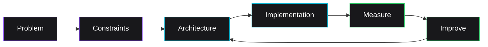
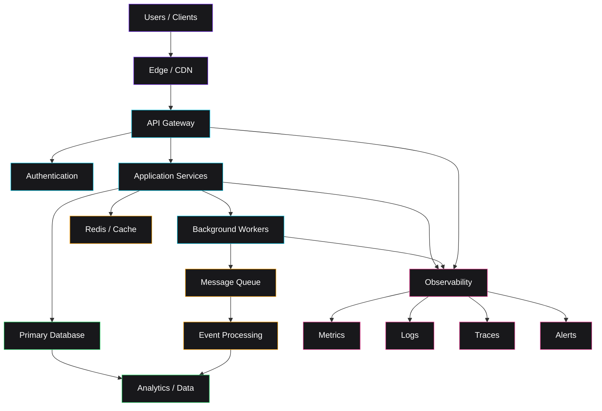
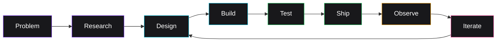
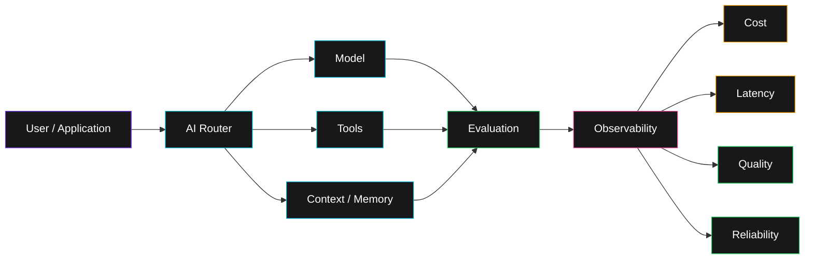
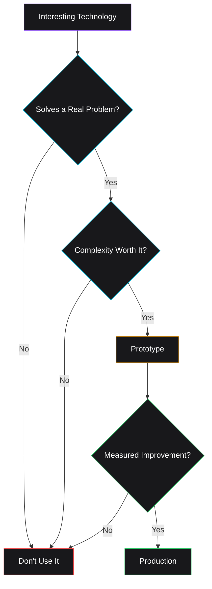

    
# DEIONX

### Full-Stack Engineer · Systems Architect · AI Engineer

**I build software that survives contact with reality.**

Production systems · Developer tooling · AI · Automation · Infrastructure

 

---

## `> whoami`

I'm **Deion** — a software engineer interested in the intersection of:

- ⚙️ **Systems**
- 🧠 **AI**
- 🎨 **Product**
- 🚀 **Infrastructure**
- 🤖 **Automation**

I like taking ambiguous problems, turning them into clean systems, and shipping software that is **fast, observable, maintainable, and useful**.

My engineering philosophy is simple:

> **Good software isn't just code that works.  
> It's software that keeps working.**

---

## `// engineering philosophy`

### The rules

**01 · Design before implementation**

Understand the problem, boundaries, constraints, and failure modes first.

**02 · Measure everything**

If something matters, it should be observable.

**03 · Automate the boring parts**

Manual repetition is an opportunity for tooling.

**04 · Make failure boring**

Timeouts, retries, rollbacks, graceful degradation, and clear recovery paths.

**05 · Keep complexity earned**

Every abstraction should solve a real problem.

**06 · Ship progressively**

Small changes. Fast feedback. Observable deployments.

---

# `// stack`

## Languages

## Frontend

## Backend

## Infrastructure

## Observability

---

# `// what I build`

<table>
<tr>

<td width="50%" valign="top">

## ⚙️ Systems

I enjoy designing software around:

- clear boundaries
- explicit contracts
- predictable failure modes
- scalability
- performance
- observability

</td>

<td width="50%" valign="top">

## 🧠 AI

Interested in practical AI systems:

- model integration
- inference
- agents
- evaluation
- automation
- AI-native applications

</td>

</tr>

<tr>

<td width="50%" valign="top">

## 🎨 Product

Building interfaces that are:

- fast
- accessible
- composable
- maintainable
- intentionally designed

</td>

<td width="50%" valign="top">

## 🚀 Infrastructure

Making engineering teams faster through:

- CI/CD
- automation
- cloud infrastructure
- developer tooling
- reproducible environments
- observability

</td>

</tr>
</table>

---

# `// system architecture`

When I think about a production system, I think in layers:

### Architectural defaults

| Principle | Approach |
|---|---|
| **Boundaries** | Keep responsibilities explicit |
| **APIs** | Stable contracts and predictable behavior |
| **Data** | Choose storage based on workload |
| **Async work** | Queues and workers where appropriate |
| **Caching** | Reduce unnecessary computation and I/O |
| **Observability** | Metrics, logs, and traces from day one |
| **Deployments** | Small, reversible, observable changes |
| **Failure** | Graceful degradation over catastrophic failure |

---

# `// development lifecycle`

**Problem → Research → Design → Build → Test → Ship → Observe → Iterate**

---

# `// AI × software`

The interesting part isn't simply **calling a model**.

It's building systems around AI that remain:

`reliable` · `observable` · `fast` · `affordable` · `testable`

---

# `// currently exploring`

<table>
<tr>
<td align="center" width="25%">

### AI Systems

Agents  
Inference  
Evaluation  
Tool use

</td>

<td align="center" width="25%">

### Distributed Systems

Queues  
Events  
Caching  
Reliability

</td>

<td align="center" width="25%">

### Developer Experience

Tooling  
Automation  
CI/CD  
Workflows

</td>

<td align="center" width="25%">

### Performance

Latency  
Throughput  
Profiling  
Optimization

</td>
</tr>
</table>

---

# `// engineering > hype`

Technology is a tool.

The question I care about is:

> **Does it make the system better?**

> **Complexity should be earned.**

---

# `// github`

 
 

 

---

### DEIONX

`systems` · `software` · `ai` · `automation` · `performance`

 

**Make it work. Make it observable. Make it last.**

 

⭐ **Build things. Break things. Learn things. Ship things.**

