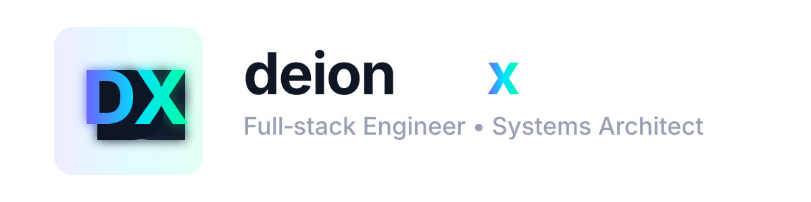

<!--
  README.md — deionx profile (2026)
  Paste this into the repository named `deionx`
-->

#  DEIONX

<p align="center">
  <strong>Full‑stack Engineer • Systems Architect • Performance‑obsessed</strong><br/>
  Building resilient systems, delightful frontends, and developer tools that scale.
</p>

---

## About

**Deionx** — I design and ship production‑grade software that balances **performance**, **clarity**, and **developer experience**. I turn complex problems into elegant, maintainable systems — from API design and infra automation to pixel‑perfect frontends.

**Focus areas**
- **System Design** — resilient, observable, cost‑efficient architectures  
- **Frontend Engineering** — fast, accessible, componentized UI with great DX  
- **Automation** — CI/CD, infra as code, release pipelines, developer tooling  
- **Performance** — p95/p99 optimization, microbenchmarks, real user metrics

---

## Tech Stack

**Languages:** `TypeScript` • `Python` • `Rust` • `Go`  
**Frontend:** `React` • `Next.js` • `Tailwind CSS` • `Vite`  
**Backend:** `Node.js` • `FastAPI` • `gRPC` • `Postgres`  
**Infra & Observability:** `Docker` • `Kubernetes` • `Terraform` • `Prometheus` • `Grafana` • `OpenTelemetry`

---

## Assets

**Wordmark**  
`./deionx-logo.svg` — use in README, docs, landing pages.

**Monogram**  
`./deionx-monogram.svg` — use as avatar, favicon, or app icon.

Display examples:

```markdown


